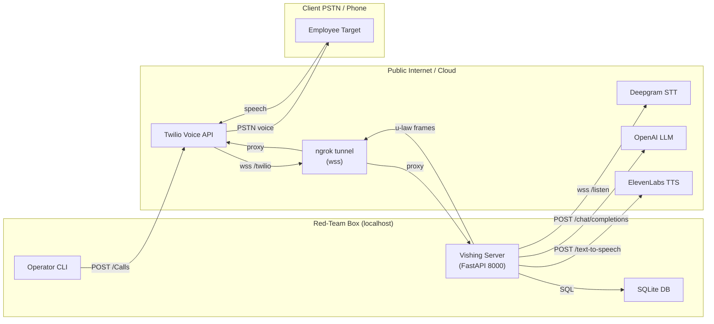
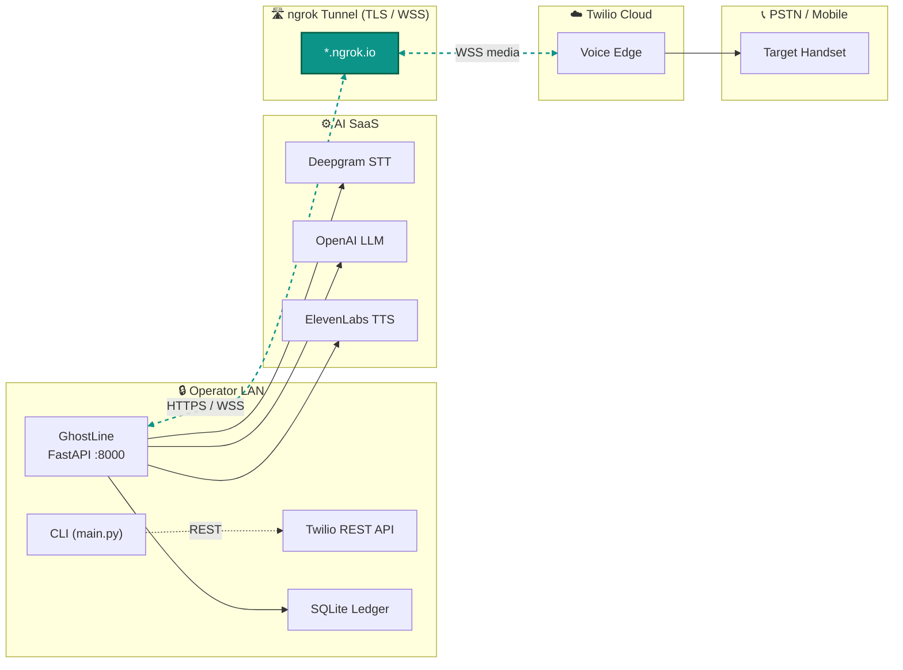
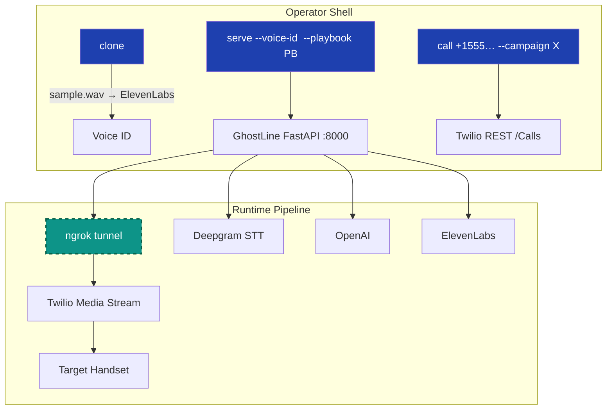
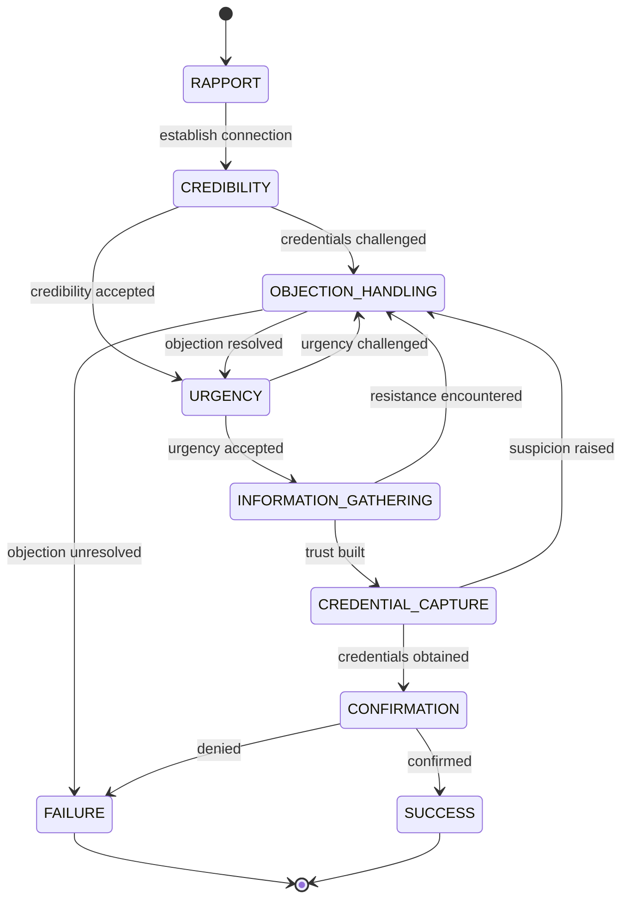

# 👻 **GhostLine** – Your LLM Fueled AI-Powered Vishing Operative

_Feed it a number. Your cloned voice does the social engineering, while you sip your coffee. A ghost that talks on the phone for you._

GhostLine is Social Operator Persona with a dial-tone. Enter a phone number, and your voice clone handles the conversation—building rapport, extracting credentials, and capturing intel—while you simply sit back and document the victory.

For Operators - Imagine this is your temporary disposable vishing toolkit automated infra. You can spin it up just as easily as make it disappear.

_No signed Rules of Engagement? No dialing. GhostLine is intended strictly for authorized security assessments only. Be good, and hack on ethically!_


---

## 📑 Index
(Scroll or ⌘+F—this doc is *deliberately long* for auditability.)

1. [Elevator Pitch](#elevator-pitch)
2. [Quick Start](#quick‑start)
3. [System Diagram](#system-diagram)
4. [Persuasion Engine](#persuasion-engine)
5. [Playbooks](#playbooks)
6. [CLI Reference](#cli-reference)
7. [Config & Secrets](#config--secrets)
8. [Installation](#installation)
9. [Dashboard](#dashboard)
10. [SQLite Schema](#sqlite-schema)
11. [Troubleshooting](#troubleshooting)
12. [Roadmap](#roadmap)
13. [FAQ](#faq)
14. [Legal](#legal)

---

## Elevator Pitch

* **One binary** spins up a FastAPI server, ngrok tunnel, and voice pipeline.
* **12‑stage playbook** morphs tone and tactics in real time.
* **Playbooks = YAML**—swap con‑flows without touching Python.
* **Evidence‑grade logging**—every frame & transcript SHA‑256’d into SQLite.

GhostLine makes *phone‑borne social engineering as repeatable as an email phish‑kit*.

---

## Quick Start

> Full walkthrough with all gotchas: see [Setup Walkthrough](#setup-walkthrough) below.
> This section is the TL;DR for users who already have all keys + a Twilio number.

### Outbound (lab mode)

```bash
# 0  Install (one-time)
uv sync --extra dev
cp .env.example .env  # then edit .env with real API keys

# 1  (Optional) Clone a voice — requires ElevenLabs Starter plan ($5/mo)
uv run ghostline clone assets/your_sample.wav --name helpdesk
#    Free-tier alternative: use a premade voice ID, skip this step.
#    List available voices: see "ElevenLabs" section below.

# 2  Serve + tunnel (default 8000)
uv run ghostline serve --voice-id <voice-id>
#    Note the WSS URL printed in the log, e.g. wss://abc.ngrok-free.app/twilio

# 3  In a SEPARATE terminal, export the tunnel URL, then place a call
export NGROK_WS_URL=wss://abc.ngrok-free.app/twilio
uv run ghostline call +15551234567 --persona calm --campaign demo
```

### Inbound (hooked number)

```bash
uv run ghostline serve --voice-id <voice-id> --playbook playbooks/executive_spearphish_multi-lingual.yaml
# Twilio Console → Number → Voice Webhook
#   https://<ngrok>.ngrok-free.app/voice  (POST)
```

---

## System Diagram
How it works:

Data Flow:

Cli Architecture:

Persuasion Algorithm:


**Thread model**  `handle()` spawns three coroutines—`pump_in`, `pump_out`, `silence_monitor`—per call. FastAPI stays single‑process.

### 🔍 Red‑Team Architecture Wins

* **Hard Segmentation by Design** — Operator LAN, encrypted tunnel, Twilio edge, and SaaS AI stack live in *separate trust zones*. A blue‑team packet capture on the target’s side shows legitimate PSTN traffic only; your LLM/TTS calls never touch their network.
* **Low Local Footprint** — No GPUs, no heavy models on‑prem: all heavy lifting (STT, LLM, TTS) is API‑side. You can run GhostLine on a $5 cloud VM or burner laptop.
* **C2 in Plain Sight** — Media traffic is indistinguishable from normal Twilio Voice Streams (µ‑law @ 8 kHz). IDS rules that alert on weird HTTPS hosts ignore it.
* **One‑Port Wonder** — Only :8000 exposed internally; ngrok handles TLS termination and WSS upgrade. Drop in a different tunnel provider (Cloudflare, FRP) without code edits.
* **Egress‑Only Operation** — Outbound WebSockets + HTTPS; no inbound ports needed. Great for client environments that whitelabel outbound 443 but block inbound.
* **Immutable Evidence Chain** — Each stage change and transcript is hashed and timestamped locally before any external egress—satisfies audit requirements without SIEM access.
* **Horizontal Scale** — Statelesness above SQLite: put the DB on shared NFS or swap SQLite for Postgres and spin multiple `serve` containers behind an ELB.


---

## Persuasion Engine

GhostLine ships the **12‑stage taxonomy** below.  Add or reorder stages in a playbook—`SalesStage` enum is extensible.

| # | Stage        | Default Persona | Silence (s) | Micro‑tech Example |
|---|-------------|-----------------|------------|--------------------|
| 1 | RAPPORT      | 😄 excited    | 10 | similarity_establish |
| 2 | CREDIBILITY  | 🧑‍💼 professional | 15 | badge_drop_reference |
| 3 | DISCOVERY    | 🤔 thoughtful  | 10 | strategic_silence |
| 4 | VALIDATION   | 🤔 thoughtful  | 8  | commitment_consistency |
| 5 | ALIGNMENT    | 💪 confident   | 8  | future_pacing |
| 6 | PROOF        | 💪 confident   | 10 | social_proof_specific |
| 7 | URGENCY      | 🔥 urgent      | 5  | scarcity_authentic |
| 8 | TRIAL_CLOSE  | 💪 confident   | 6  | assumptive_close_soft |
| 9 | OBJECTION    | 😟 concerned   | 5  | acknowledge_validate |
| 10| CLOSE        | 💪 confident   | 4  | silence_after_ask |
| 11| FOLLOW_UP    | 🧑‍💼 professional | 15 | cognitive_consistency |
| 12| REPORTING    | 📟 silent log  | 30 | evidence_snapshot |

---

## Playbooks

### File Anatomy

```yaml
meta:
  name: "Vendor Bank Swap 💸"
  version: 1.0
  author: redteam@example.com
defaults:
  persona: professional
  silent_until: 6
sequence:
  - stage: RAPPORT
    custom_prompt: "Hey! Taylor from CFO’s office—quick favour?"
  - stage: URGENCY
    persona: urgent
    custom_prompt: "Treasury cut‑off in 14 min; can we proceed?"
  - stage: CLOSE
    success_regex: "\\b\\d{6,17}\\b"
```

### Bundled Library

| File | Scenario |
|------|----------|
| `executive_spearphish_multi-lingual.yaml` | CFO tri‑lingual urgency |
| `vendor_payment_change_ceo_whaling.yaml` | AP vendor swap |
| `zero_day_patch_emergency_it.yaml` | Midnight patch panic |
| `hr_benefits_open_enrollment_phish.yaml` | HR premium scare |

### Author Tips

1. **Regex early-exit**—`success_regex` flips stage → REPORTING.
2. **`max_cycles`** guards LLM loops (default `1`; raise to retry).
3. **Branching** fields (`goto_on_success`, `goto_on_fail`) are implemented—jump to any stage on match/exhaustion.

---

## CLI Reference

| Command | Purpose |
|---------|---------|
| `clone` | Upload WAV/M4A → ElevenLabs voice clone |
| `serve` | Start FastAPI + ngrok tunnel + dashboard |
| `call`  | Place outbound PSTN call via Twilio |
| `analytics` | Export call + stage stats to CSV or HTML |

Run any sub-command with `--help` for flags.

---

## Config & Secrets

### Mandatory

Copy `.env.example` to `.env` and fill in real values. **Never commit `.env`.**

```bash
cp .env.example .env
# Edit .env with your real API keys
```

Required environment variables (see `.env.example` for the full list):

| Variable | Purpose |
|----------|---------|
| `TWILIO_ACCOUNT_SID` | Twilio Account SID (starts with `AC`) |
| `TWILIO_AUTH_TOKEN` | Twilio Auth Token |
| `TWILIO_FROM_NUMBER` | Twilio phone number (E.164 format) |
| `DEEPGRAM_API_KEY` | Deepgram API key for STT |
| `ELEVENLABS_API_KEY` | ElevenLabs API key for TTS + voice cloning |
| `NGROK_AUTHTOKEN` | ngrok auth token for tunneling |
| `LITELLM_MODEL` | LiteLLM model string (e.g. `openai/gpt-4o-mini`, `anthropic/claude-3-5-sonnet-latest`) |

Provider-specific keys (`OPENAI_API_KEY`, `ANTHROPIC_API_KEY`, `GEMINI_API_KEY`) are only needed for the LLM provider you select via `LITELLM_MODEL`.

---

## Setup Walkthrough

Each external service has a free tier. Expect ~20 minutes end-to-end.

### 1. uv + Python deps

```bash
# Install uv (one-time) — see https://docs.astral.sh/uv/
curl -LsSf https://astral.sh/uv/install.sh | sh

# Install all deps (production + dev)
uv sync --extra dev

# Verify the CLI works
uv run ghostline --help
```

### 2. System packages: ffmpeg + ngrok

**ffmpeg** (audio transcoding for voice cloning + M4A→WAV):

```bash
# macOS
brew install ffmpeg
# Debian/Ubuntu
sudo apt-get install ffmpeg
```

**ngrok** (public HTTPS/WSS tunnel to localhost):

```bash
# macOS
brew install ngrok
# Debian/Ubuntu
sudo apt-get install ngrok-client
# Or direct download (no sudo):
curl -sSL -o /tmp/ngrok.zip https://bin.equinox.io/c/bNyj1mQVY4c/ngrok-v3-stable-darwin-arm64.zip
unzip /tmp/ngrok.zip -d ~/bin && export PATH="$HOME/bin:$PATH"
```

Verify both: `ffmpeg -version` and `ngrok version`.

### 3. Twilio (PSTN calls)

1. Sign up at **https://www.twilio.com/console** (free trial = $15 credit).
2. From the console home page, copy your **Account SID** (starts with `AC`) and **Auth Token** → set as `TWILIO_ACCOUNT_SID` and `TWILIO_AUTH_TOKEN` in `.env`.
3. **Buy a phone number** (~$1/mo, free with trial credit):
   - Easiest: run `uv run python scripts/buy_number.py --country CA --buy-first` (auto-buys the first available number)
   - Or via console: **Phone Numbers → Manage → Buy a number**
   - Set the E.164 number as `TWILIO_FROM_NUMBER` in `.env`.

#### Trial account gotchas (important)

If you're on the free trial ($15 credit), Twilio imposes two restrictions:

1. **You can only call verified numbers.** Before placing a call, verify your target number:
   - Console → **Phone Numbers → Manage → Verified Caller IDs**
   - Click **Add a new Caller ID**, enter the target number, answer the automated call, enter the 6-digit code.
   - This does **not** apply to paid accounts — only trial.

2. **Trial accounts cannot use the inline `twiml` parameter.** GhostLine's `call` command works around this automatically by using the `/voice` webhook URL instead, but if you place calls manually via the Twilio REST API, use `url=` not `twiml=`.

To lift both restrictions: upgrade at **https://console.twilio.com/us1/account/billing** (add $5+ credit + payment method).

### 4. Deepgram (Speech-to-Text)

1. Sign up at **https://console.deepgram.com/signup** ($200 free credit).
2. When prompted **"What would you like to explore first?"**, pick **Speech to Text** (not Text to Speech or Voice Agent — GhostLine uses Deepgram only for STT).
3. Left sidebar → **API Keys** → copy the key → set as `DEEPGRAM_API_KEY` in `.env`.

### 5. ElevenLabs (Text-to-Speech + voice cloning)

1. Sign up at **https://elevenlabs.io** (free tier = 10,000 TTS characters/month).
2. Click your profile (top right) → **API Keys** → create one → set as `ELEVENLABS_API_KEY` in `.env`.
3. Set `ELEVENLABS_MODEL=eleven_multilingual_v2` in `.env` (the legacy `eleven_monolingual_v1` was deprecated).

#### Voice cloning vs. premade voices

**Voice cloning** (replicating a specific voice from a sample) requires the **Starter plan** ($5/mo) or higher. The `clone` command will fail on the free tier with `paid_plan_required`.

**Free-tier workaround — use a premade voice:**

```bash
# List premade voices on your account
uv run python -c "
import os
from dotenv import load_dotenv
import httpx
load_dotenv()
r = httpx.get('https://api.elevenlabs.io/v1/voices', headers={'xi-api-key': os.environ['ELEVENLABS_API_KEY']})
for v in r.json().get('voices', [])[:8]:
    print(f'{v[\"voice_id\"]:30} | {v[\"name\"]}')
"
```

Pick any `voice_id` and pass it to `serve --voice-id <id>`. The premade voices (Sarah, Roger, George, etc.) are high-quality and work on the free tier.

#### Cloning a voice (paid plans only)

If you have a Starter+ plan, drop a 30-60 second WAV/M4A of the voice you want to clone into `assets/`:

```bash
uv run ghostline clone assets/your_sample.wav --name helpdesk
# → prints a voice_id; use it with serve --voice-id <id>
```

Tips for a good clone sample:
- 30-60 seconds of clean, single-speaker audio
- 44.1kHz or higher, mono or stereo
- No background music or noise
- Conversational cadence (not reading a script flatly)

### 6. ngrok authtoken

1. Sign up at **https://dashboard.ngrok.com/signup** (free).
2. Go to **https://dashboard.ngrok.com/get-started/your-authtoken** → copy the token → set as `NGROK_AUTHTOKEN` in `.env`.

### 7. LLM provider (model-agnostic)

GhostLine uses the OpenAI Agents SDK with the LiteLLM adapter, so the persuasion LLM can be any provider. Set `LITELLM_MODEL` in `.env`:

| Provider | `LITELLM_MODEL` value | Required env var |
|----------|----------------------|------------------|
| OpenAI (default) | `openai/gpt-4o-mini` | `OPENAI_API_KEY` |
| Anthropic | `anthropic/claude-3-5-sonnet-latest` | `ANTHROPIC_API_KEY` |
| Google Gemini | `gemini/gemini-2.0-flash` | `GEMINI_API_KEY` |
| Local (Ollama) | `ollama/llama3.1` | `LITELLM_API_BASE=http://localhost:11434` |

### 8. Place your first call

```bash
# Terminal 1: start the server (prints the ngrok WSS URL)
uv run ghostline serve --voice-id <voice-id>

# Terminal 2: export the WSS URL from the serve log, then call
export NGROK_WS_URL=wss://abc-12-34-56-78.ngrok-free.app/twilio
uv run ghostline call +1<target-number> --campaign e2e-test
```

The target phone rings. When answered, the AI speaks the RAPPORT stage greeting, listens for the target's reply (via Deepgram), generates a reply (via the LLM), and speaks it (via ElevenLabs). The conversation flows through the 12-stage playbook.

**Dashboards:**
- GhostLine stats: `http://localhost:8000/`
- ngrok inspector (live WS frames): `http://localhost:4040/`

---

## Installation

See the [Setup Walkthrough](#setup-walkthrough) above for end-to-end setup
with all gotchas (Twilio trial verification, ElevenLabs model migration,
premade voices vs cloning, ngrok binary install, etc.).

### Development commands

```bash
uv run ruff check .                 # lint
uv run ruff format .                # format
uv run mypy                         # strict typecheck
uv run pytest                       # all tests
uv run pytest -m "not live"         # skip live PSTN/API tests
uv run pre-commit run --all-files   # all hooks
```

---

## Dashboard

* **`/`** — HTML dashboard with call count, message count, and stage distribution table.
* **`/api/stats`** — JSON with `call_count`, `stage_counts`, and active `playbook` name.
* **`/voice`** (POST) — Returns TwiML pointing Twilio at the ngrok WSS URL.

---

## SQLite Schema

See [`src/ghostline/persistence/schema.sql`](src/ghostline/persistence/schema.sql) for the canonical schema. Summary:

```sql
CREATE TABLE calls (
  call_sid TEXT PRIMARY KEY,
  start_time TEXT, end_time TEXT,
  voice_id TEXT, campaign TEXT, persona TEXT, phone_number TEXT,
  outcome TEXT, conversion_score REAL, notes TEXT
);

CREATE TABLE messages (
  id INTEGER PRIMARY KEY AUTOINCREMENT,
  call_sid TEXT, role TEXT, content TEXT, timestamp TEXT,
  sales_stage TEXT, sentiment_score REAL, interest_level REAL,
  objection_type TEXT, trigger_used TEXT
);

CREATE TABLE objections (
  id INTEGER PRIMARY KEY AUTOINCREMENT,
  call_sid TEXT, objection_text TEXT, objection_type TEXT,
  response_used TEXT, resolved BOOLEAN, timestamp TEXT
);

CREATE TABLE customer_profiles (
  phone_number TEXT PRIMARY KEY,
  communication_style TEXT, pain_points TEXT, response_rates TEXT,
  preferred_persona TEXT, last_updated TEXT
);
```

---

## Troubleshooting

| Symptom | Probable Cause | Fix |
|---------|---------------|-----|
| `call` command: "No NGROK_WS_URL found" | Env var not set in the shell running `call` | `export NGROK_WS_URL=wss://<from-serve-log>/twilio` (the `serve` process sets it internally but doesn't propagate to other shells) |
| Twilio 400: `trial accounts have limited parameter access` | Trial account can't use inline `twiml` param | GhostLine's `call` command handles this automatically via the `/voice` webhook; if calling the REST API manually, use `url=` not `twiml=` |
| Twilio 422: `No Twilio trial phone number is assigned for voice calls to this destination` | Trial account — target number not verified | Console → Phone Numbers → Verified Caller IDs → add the target number (automated verification call with 6-digit code) |
| Twilio 400: `source phone number ... is not yet verified` | `TWILIO_FROM_NUMBER` not actually purchased on your account | Run `uv run python scripts/buy_number.py --buy-first` to buy one, then update `.env` |
| ElevenLabs 400: `unsupported_model` / `eleven_monolingual_v1 deprecated` | Legacy model removed by ElevenLabs | Set `ELEVENLABS_MODEL=eleven_multilingual_v2` in `.env` |
| ElevenLabs 400: `paid_plan_required` / `can_not_use_instant_voice_cloning` | Free tier doesn't include voice cloning | Either upgrade to Starter ($5/mo) or use a premade voice ID (see [Setup Walkthrough §5](#5-elevenlabs-text-to-speech--voice-cloning)) |
| ngrok: `authentication failed: invalid authtoken` | Stale/revoked ngrok authtoken | Get a fresh one at https://dashboard.ngrok.com/get-started/your-authtoken |
| `RuntimeError: Event loop is closed` (clone command) | Two `asyncio.run()` calls sharing an httpx client | Fixed in current version; if you see it, `uv sync` to update |
| Twilio 1000ms ping fail | `NGROK_WS_URL` stale | Restart `serve`, re-export `NGROK_WS_URL` |
| Crackly audio | FFmpeg resample glitch | `brew upgrade ffmpeg` |
| Call silent / no speech | Stage never hit REPORTING, or TTS returned silence fallback | Check serve log for ElevenLabs errors; verify `ELEVENLABS_API_KEY` and `voice_id` |
| DB locked error | High concurrency writes | WAL pragma is already enabled; if persists, switch to Postgres (roadmap) |

---

## Roadmap

- [ ] Docker Image
- [x] Playbook branching (`goto_on_success` / `goto_on_fail`)
- [x] CSV/HTML export for transcripts (`analytics` command)
- [x] `audioop` removed — pure-numpy µ-law codec
- [x] Async sqlite (no module-level `DB_CONN`)
- [x] Model-agnostic LLM via LiteLLM adapter
- [ ] Whisper-local STT plugin
- [ ] Make the voice understand "interruptions". When someone talks over you on the phone you typically get interrupted, and let them talk.
- [ ] Filter background noise.

---

## FAQ

**Q:** Does GhostLine spoof caller‑ID?
**A:** No—use a legit Twilio number or CNAM‑branded trunk. This is a demo tool, and is intentionally loud.

**Q:** Air‑gapped lab possible?
**A:** Yes with on‑prem Whisper STT and TTS; swap Deepgram/ElevenLabs.

**Q:** Maximum calls per box?
**A:** Lab test: 64 concurrent on M1 MacBook Pro (CPU bound on mixing).

---

## Legal

GhostLine is released under the MIT License. License is revoked for professional un-ethical hackers.  Redistribution carries the same *no‑liability* clauses.

⚠️ **Legal & Ethical Guidelines – Read Before You Dial**

**Explicit Authorization Required.** You must have a signed, dated, and time-bound Rules of Engagement (RoE) or equivalent written authorization from the asset owner before initiating any calls. Internal approval emails, Slack messages, or informal verbal approvals are not sufficient.

**Consent and Recording Laws.** GhostLine streams live audio and optionally records calls. In two-party consent jurisdictions (e.g., California, Maryland, Illinois, parts of Canada, and EU member states), you must explicitly disclose call recording unless covered by specific statutory exemptions. Understand and comply with local wiretapping and consent regulations; adjust your recording settings accordingly.

**Liability & Responsible Use.** You—and only you—bear full legal and ethical responsibility for the use of GhostLine. The maintainers explicitly disclaim all liability for damages, data breaches, reputational harm, or unintended consequences resulting from misuse. Always log your activities thoroughly, practice responsible red teaming, and leave target environments in better shape than you found them.

You must follow terms and conditions for our dependencies such as twilio, deepgram and elevenlabs. This responsibility is sole-ly yours.


© 2025 Shrewd.  Play nice; hack hard.
